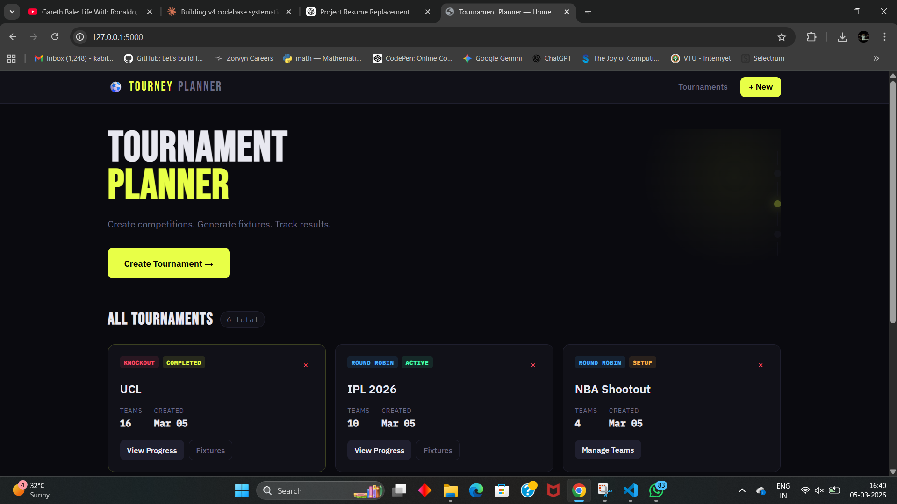
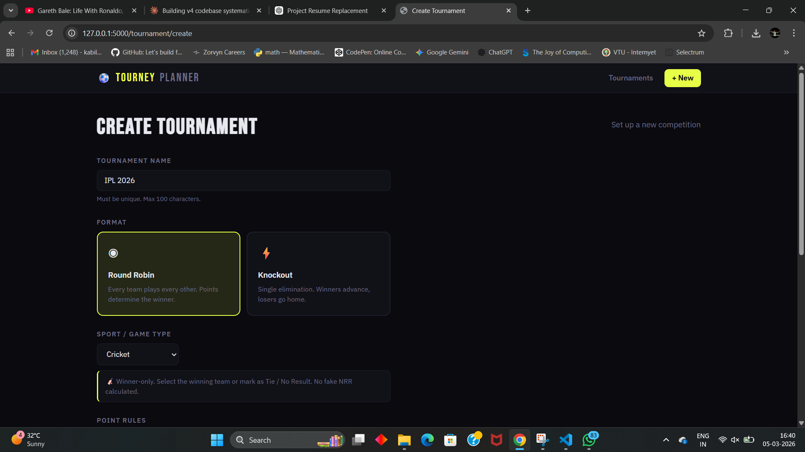
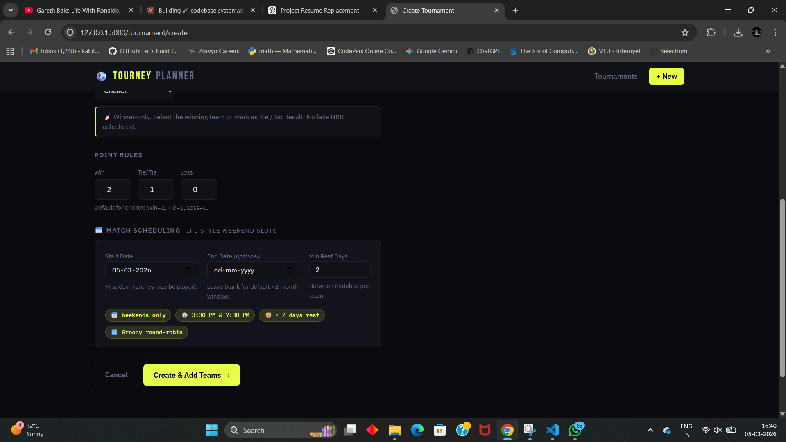
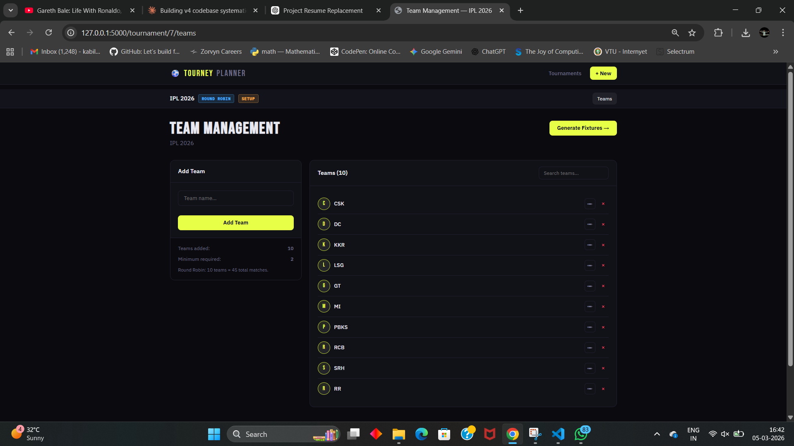
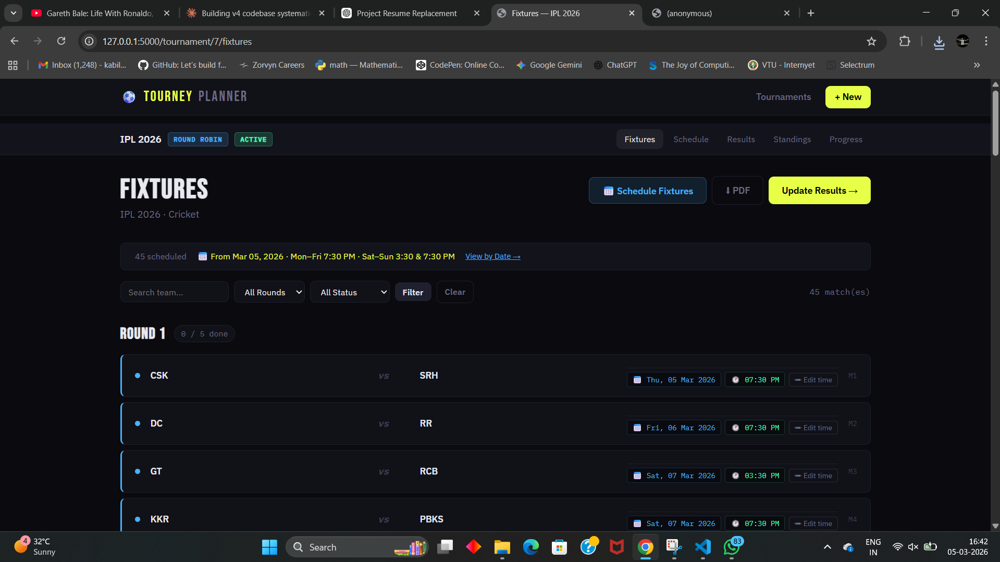
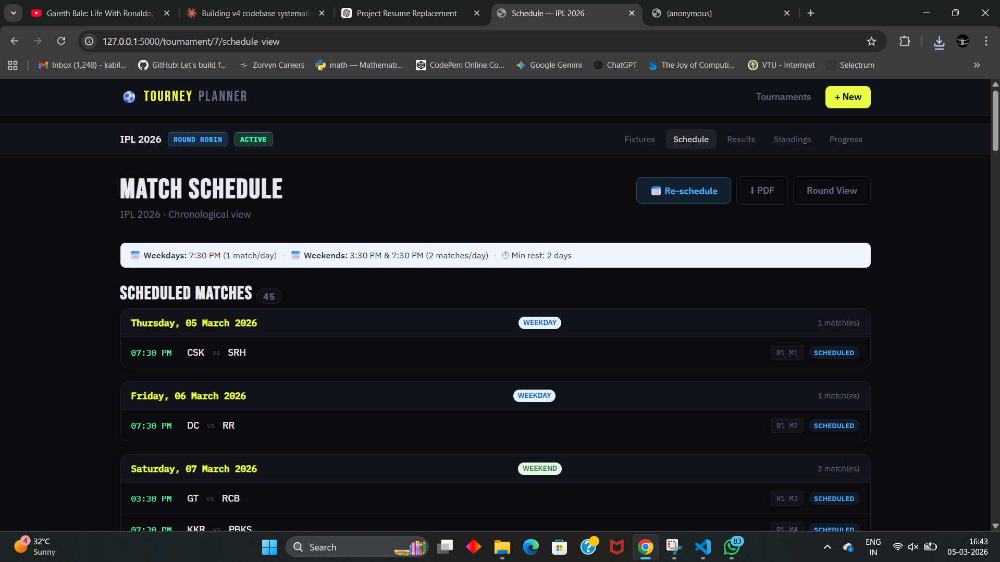
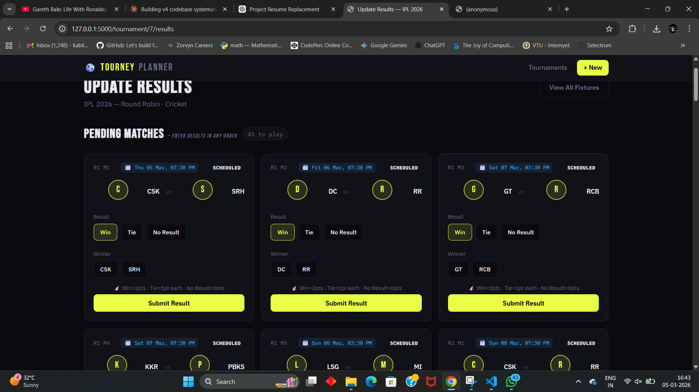

# Tournament Planner v6

A clean, interview-ready Flask tournament management system supporting
**Round Robin** and **Knockout** formats with sport-aware result modes.

---

## Features

| Feature | Status |
|---------|--------|
| Round Robin + Knockout formats | ✅ |
| Football, Cricket, Basketball, Esports | ✅ |
| Score-based & Winner-only result modes | ✅ |
| IPL-style daily spread scheduling | ✅ |
| Manual schedule editing with hard validation | ✅ |
| Manual lock (auto-scheduler won't overwrite) | ✅ |
| Round Robin: results in any order | ✅ |
| Knockout: round-gated progression | ✅ |
| Standings with correct tiebreakers | ✅ |
| Chronological Schedule View | ✅ |
| Fixtures PDF export (Round Robin) | ✅ |
| Odd/even team count with byes | ✅ |
| Case-insensitive duplicate team protection | ✅ |
| CSRF protection on all POST forms | ✅ |

---

## Quick Start

```bash
pip install -r requirements.txt
python seed.py          # optional demo data
python app.py
# → http://localhost:5000
```

---

## Scheduling Rules (IPL-style daily spread)

| Day | Slots Available | Max Matches/Day |
|-----|----------------|-----------------|
| Monday–Friday | 7:30 PM | 1 |
| Saturday–Sunday | 3:30 PM, 7:30 PM | 2 |

### Rest gap
Configurable minimum rest between a team's matches (default: 2 days).
Teams never play twice on the same day.

### Manual schedule editing
Admins can set a specific date/time for any match via the Fixtures page.
Rules enforced as **hard errors** (not warnings):
- Time must be one of the allowed slots (15:30 or 19:30)
- Day capacity rules apply (e.g. 15:30 not allowed on weekdays)
- Date must be within the tournament window (if configured)
- Same-team same-day conflicts are rejected
- Minimum rest gap respected

After saving, the match is **locked** (🔒). Re-running the auto-scheduler
will skip locked matches, preserving your manual corrections.

---

## Result Entry

### Round Robin
All pending matches are editable in any order. No round-based locking.
Use the **Edit** button on completed matches to correct results —
standings are fully recalculated.

### Knockout
Only the current round is open for result entry. Future rounds are
unlocked automatically when all current-round matches are complete.

---

## Sport Modes

| Sport | Mode | Outcomes |
|-------|------|----------|
| Football | Score-based | Win / Draw / Loss |
| Basketball | Score-based | Win / Loss (no draws) |
| Cricket | Winner-only | Win / Tie / No Result |
| Esports | Winner-only | Win only |
| Generic | Score-based | Win / Draw / Loss |

Knockout: ties/draws are always blocked regardless of sport.

---

## Fixtures PDF Export

Available for Round Robin tournaments. Click **⬇ PDF** on the Fixtures or
Schedule pages.

Layout:
- **Scheduled**: grouped by date in chronological order
- **Unscheduled**: separate section at the bottom
- **Unscheduled entirely**: grouped by round

---

## Team Name Uniqueness

Team names are case-insensitively unique per tournament, enforced at two layers:
1. **Python layer**: fast UI feedback before DB round-trip
2. **Database layer**: `name_key` column (normalised lowercase) has a
   `UNIQUE` constraint per tournament — prevents duplicates even if Python
   check is bypassed

---

## Architecture

```
app.py                  Flask app factory + CSRF init
models.py               SQLAlchemy models + sport constants
fixture_engine.py       Berger round-robin + knockout generation
scheduler.py            IPL-style daily spread scheduler + manual validation
routes/
  tournament_routes.py  Create, delete, generate fixtures, run scheduler
  team_routes.py        Add, edit, delete teams (case-insensitive checks)
  match_routes.py       Results, edits, manual schedule with lock
  standings_routes.py   Standings, progress, schedule view, PDF export
templates/              Jinja2 HTML templates
static/css/style.css    All styling
static/js/app.js        Minimal JS helpers
tests.py                43 tests covering all critical paths
```

---

## Honest Limitations

- No real-time data (no WebSockets, no live scores)
- Cricket NRR not calculated — requires ball-by-ball data we don't collect
- No user authentication — single-admin assumption
- Knockout result edits not supported after bracket progression

---

## Running Tests

```bash
pip install -r requirements.txt
python tests.py
```

---

## Screenshots

### Home


### Create Tournament


### Scheduling & Rules Setup


### Team Management


### Fixtures (Round View)


### Schedule (Chronological View)


### Update Results

